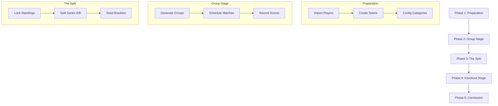

# Tournament Genie - Workflow Lifecycle

This document describes the end-to-end lifecycle of a tournament managed with Tournament Genie.

---

## 📈 The Tournament Lifecycle

---

## 🛠️ Phase 1: Preparation
**Goal**: Establish the base data for the tournament.

1.  **Player Registration**: Add players manually or via bulk import.
2.  **Team Formation**: Group players into pairs. Ensure categories (MD/WD/XD) are correctly assigned.
3.  **Global Settings**: Enable/Disable features like **Second Chance** or specific scoring modes (Single Game vs Best of 3).

## 🕒 Phase 2: Group Stage
**Goal**: Complete all round-robin matches and determine rankings.

1.  **Grouping**: Assign teams to groups. Use the `RANDOM_WITH_SEEDS` mode if you want the system to handle distribution.
2.  **Live Scheduling**: Navigate to the **Schedule** page. Toggle to **Group Stage** and enable **Auto-Schedule**.
3.  **Score Entry**: Referees or Admins record scores. As matches complete, rankings update instantly.
4.  **Verification**: Review the standings. Use **Save Result** for any manual adjustments if necessary.

## 🔒 Phase 3: The Transition (Critical)
**Goal**: Finalize group results and prepare for elimination rounds.

1.  **Locking**: Once all group matches are done, **Lock the Group Stage**. 
    > [!WARNING]
    > Locking prevents further edits to group scores. This is necessary to freeze the rankings used for knockout seeding.
2.  **Series Split**: The system qualified the top teams for **Series A** (typically the top 8) and the remainder for **Series B**.
3.  **Bracket Generation**: Generate the knockout brackets for each category and series.

## 🏆 Phase 4: Knockout Stage
**Goal**: Run the elimination bracket to find the winners.

1.  **Scheduling**: Switch the **Schedule** page toggle to **Knockout**.
2.  **Elimination**: Matches are played as Single Elimination. 
3.  **Second Chance (If Enabled)**: Monitor the Series A Quarterfinal results. Losers will automatically appear in the Series B Quarterfinal bracket.
4.  **The Finals**: The culmination of the event. Use **Force Next** to ensure the final match gets immediate court assignment.

## ✅ Phase 5: Conclusion
**Goal**: Award winners and archive results.

1.  Review final brackets for Series A and Series B.
2.  Export or record the final podium positions.

---

## 💡 Operational Best Practices

*   **Handling Delays**: Use the **Block Match** feature if a team is temporarily unavailable (e.g., medical timeout).
*   **Court Management**: Lock courts that are under maintenance or reserved for practice.
*   **Rest Management**: The system suggests the "most rested" matches. Trust the queue order to keep the tournament moving fairly.
